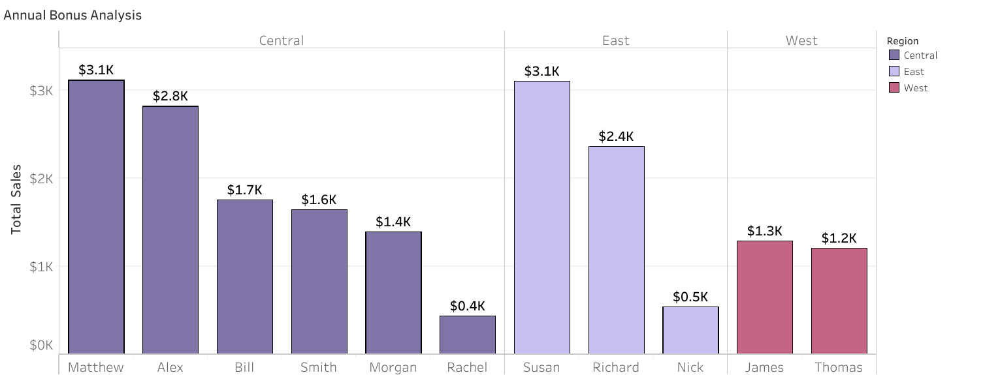

# SECTION 2 – Tableau Basics

## Workesheet: Annual Bonus Analysis

### Background:

Its the end of te financial year and that means time for annual bonuses.

The store operates in three different regions and only the top-performing employee in each region qualifies for a bonus.

Find out which three employees are eligible to get a bonus for this year.

Employees are measure on total value of sales.

[View on Tableau Public](https://public.tableau.com/views/UdemyTutorial_Section2/AnnualBonusAnalysis?:language=en-US&publish=yes&:sid=&:redirect=auth&:display_count=n&:origin=viz_share_link)

