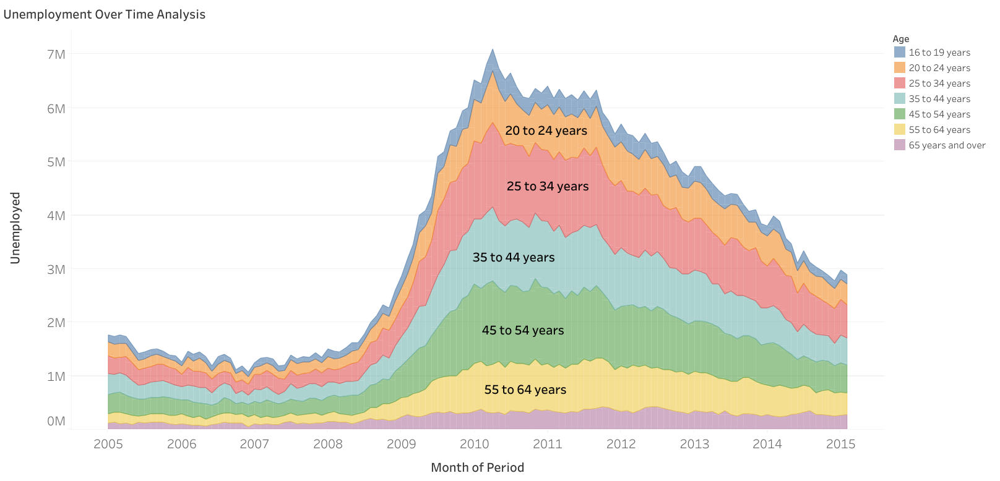

# SECTION 3 – Time Series. Aggregation. Filters

## Notes: 
[Notion Notes](https://humble-moose-4ea.notion.site/SECTION-3-21beba4a2d0c80f0823bc805f3ad2aba?pvs=143)

## Workesheet: Unemployment Over Time Analysis

### Task:

Visualize unemployment trends over time by age group, and allow users to interactively filter the data by gender in order to explore how unemployment patterns differ between male and female populations.

[View on Tableau Public](https://public.tableau.com/app/profile/bohdanovych.sofiia/viz/Unemployment-Over-Time-Analysis/UnemploymentOverTimeAnalysis)
