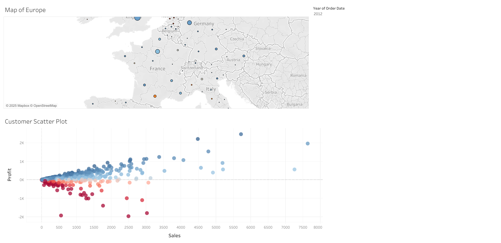

# SECTION 4 - Maps. Scatterplots. Building a dashboard

## Sales & Profit Analytics Dashboard

This dashboard consists of two interactive visualizations:

### 1. Map of Europe
- Displays sales using bubbles of varying sizes and profit margin (profitability) using color.
- Supports a geographic hierarchy: Country → State → City.
- Users can drill down interactively to choose the desired level of geographic detail.
### 2. Customer Scatter Plot
- Visualizes the relationship between customer sales and profit.
- Each point represents a customer, showing how their sales correlate with profitability.
---
## Interactivity & Features

### 1. Synchronized Filters
    
Implemented a multiple worksheets filter option to synchronize filtering between the map and scatterplot.
    
### 2. Highlighting Action
    
Added a highlighting action:

- When hovering over a specific country, state, or city (depending on the selected geographic detail),
- The corresponding customers are highlighted on the scatterplot.
---    
## Resources

- Notion Notes: [View notes](https://humble-moose-4ea.notion.site/SECTION-4-21deba4a2d0c80bda723f2eedf99acaa?source=copy_link)  
- Tableau Public Dashboard: [View the dashboard](https://public.tableau.com/shared/FD3GFM39G?:display_count=n&:origin=viz_share_link)  
- Dashboard Preview:
  
