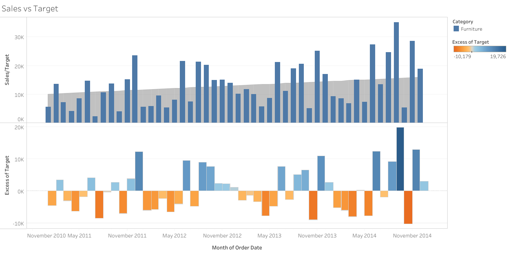

# SECTION 5 - Joining & Blending. Dual Axis Chart
## Notes: 
[Notion Notes](https://humble-moose-4ea.notion.site/SECTION-5-259eba4a2d0c80849814c361b52f0efa?source=copy_link)
## Worksheet: Sales VS Target 
### Dataset
We have three excel sheets containing information about orders:
1. **Orders Sheet** – Contains general information about orders, including a **unique ID** for each order.
2. **Order Breakdown Sheet** – Contains details about the **items** in each order. The **department** of each item is also specified.
3. **Targets Sheet** – Contains information about the **month** of an order, the **category/department** of the items, and the **sales target**.
### Task
Visualize monthly sales from 2011 to 2015 for the Furniture, Office Supplies, and Technology departments, and show how actual sales compare to their targets.
The view is splited in two sections:
1. Sales vs Target — a dual-axis chart:
      - Bar chart shows monthly sales per department
      - Area chart in the background shows monthly sales targets per department
      - A filter allows users to switch between departments
2. Difference Chart — shows the variance between actual and target sales, with color coding to highlight positive or negative differences
### Tech Stack
1. Join — to connect the Orders and Order Breakdown sheets
2. Blending — to integrate Targets data (linked by month and category) into the same view as the sales data
3. Calculated Field — to compute the difference between actual and target sales
4. Filter — to allow users to reconstruct the visualization by department

[View on Tableau Public](https://public.tableau.com/views/Section5_17563063684790/SalesvsTarget?:language=en-US&:sid=&:redirect=auth&:display_count=n&:origin=viz_share_link)
