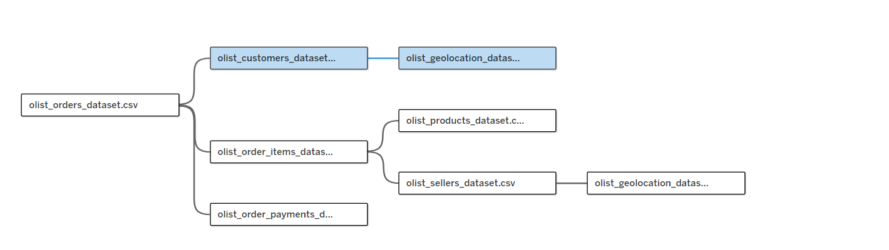
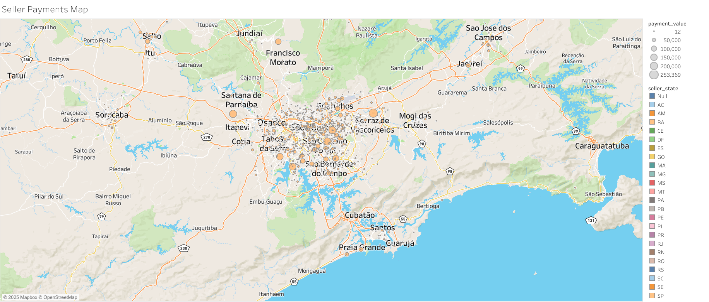

# SECTION 5 — Data Model: Working with Relationships

## Notes  
[Notion Notes](https://humble-moose-4ea.notion.site/SECTION-5-259eba4a2d0c80849814c361b52f0efa?source=copy_link)

## Worksheet: Seller Payments Map

### Dataset  

### Task  
Visualize sellers on a map at their geolocations, using bubble sizes to represent the **total amount of payments** they have received from customers.

### Tech Stack  
Instead of manually joining tables on common fields — which could lead to **granularity issues** and **duplicate records** — we built a **relational data model** in Tableau.  
This approach keeps the data in **separate tables** and lets Tableau **dynamically merge the data** when fields are used in a view.

### Preview  

[View on Tableau Public](https://public.tableau.com/views/Section5-2_17565409668780/SellerPaymentsMap?:language=en-US&:sid=&:redirect=auth&:display_count=n&:origin=viz_share_link)
